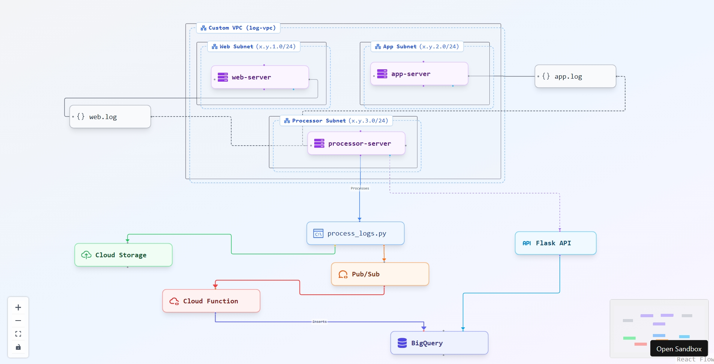

## Distributed Log Aggregation and Analytics System with GCP Networking

Welcome to the **Distributed Log Aggregation and Analytics System** project! This repository showcases a system that collects logs from multiple Linux virtual machines (VMs) within a custom Google Cloud Platform (GCP) Virtual Private Cloud (VPC), processes them using Python, stores and analyzes the data with GCP services, and provides insights through a Flask API. The setup is automated with Bash scripts and demonstrates advanced GCP networking concepts.

This project is perfect for those looking to explore cloud computing, Linux, Python, and GCP services in depth. However, it’s **not suitable for beginners** without a strong foundation in these areas. Please ensure you fully understand the concepts before attempting to set up or modify this project.

---

## Table of Contents
- [Project Overview](#project-overview)
- [Architecture](#architecture)
- [Prerequisites](#prerequisites)
- [Setup Instructions](#setup-instructions)
- [API Endpoints](#api-endpoints)
- [Testing and Validation](#testing-and-validation)
- [Google Cloud Resources for New Users](#google-cloud-resources-for-new-users)
- [⚠️ Important Notice for New Users](#⚠️-important-notice-for-new-users)

---

## Project Overview
This project builds a distributed system to:
- Generate logs on two VMs: `web-server` and `app-server`.
- Transfer logs to a central `processor-server` VM for processing.
- Process logs with Python, store them in [Cloud Storage](https://cloud.google.com/storage), and publish events to [Pub/Sub](https://cloud.google.com/pubsub).
- Load processed data into [BigQuery](https://cloud.google.com/bigquery) using a [Cloud Function](https://cloud.google.com/functions).
- Provide log analytics through a Flask API hosted on `processor-server`.

The system runs within a custom VPC with isolated subnets and firewall rules, highlighting GCP’s networking capabilities.

---

## Architecture
The architecture is illustrated below, showing the flow from log generation to analytics.

<p align="center">
  
</p>
<p align="center"><em>Project Architecture</em></p>

The above architecture represents a **robust, secure, and scalable log processing pipeline** on **Google Cloud Platform (GCP)**, leveraging a **custom VPC** with isolated **Web, App, and Processor subnets** to ensure security and high availability. Logs from the **web-server** and **app-server** are securely transferred to the **processor-server** over **SSH (Port 22)**, with **firewall rules restricting access to trusted IPs** only. The **processor-server** processes logs using `process_logs.py` and uploads the transformed data to **Cloud Storage**, while also publishing structured logs to **Pub/Sub** for downstream analytics. **Cloud Functions** automate workflows, and **BigQuery** enables real-time log analysis. The **Flask API** provides controlled external access. With **network segmentation**, even if one subnet is compromised, the others remain protected, ensuring **strong isolation, security, and fault tolerance** in this **cloud-native design**. 🚀

**Key Components**:
- **VMs**: `web-server` and `app-server` generate logs; `processor-server` handles processing and hosts the API.
- **GCP Services**: Cloud Storage for storage, Pub/Sub for messaging, BigQuery for analytics, and Cloud Functions for serverless data loading.
- **Networking**: A custom VPC with three subnets for resource isolation.

[Click here for the (flow chart type of) project architecture](./architecture%20-%20flowchart%20type.png)

---

## Prerequisites
To get started, you’ll need:
- A [Google Cloud](https://cloud.google.com/) account with billing enabled.
- Familiarity with [Linux](https://cloud.google.com/compute/docs/instances/connecting-to-instance), [Bash](https://cloud.google.com/compute/docs/instances/connecting-to-instance#connecting_to_an_instance), and [Python](https://www.python.org/).
- Basic knowledge of GCP services: [Compute Engine](https://cloud.google.com/compute), [Cloud Storage](https://cloud.google.com/storage), [Pub/Sub](https://cloud.google.com/pubsub), [BigQuery](https://cloud.google.com/bigquery), and [Cloud Functions](https://cloud.google.com/functions).
- The [Google Cloud SDK](https://cloud.google.com/sdk/docs/install) (`gcloud`) installed locally.
- Understanding of [VPC networking](https://cloud.google.com/vpc) and [IAM permissions](https://cloud.google.com/iam).

---

## Setup Instructions
1. **Set Up Project and Enable APIs**:
   - Create a GCP project or use an existing one.
   - Enable necessary APIs:
     ```bash
     gcloud services enable compute.googleapis.com storage.googleapis.com pubsub.googleapis.com bigquery.googleapis.com cloudfunctions.googleapis.com
     ```

2. **Configure Networking**:
   - Create a custom VPC with three subnets.
   - Add firewall rules for SSH and HTTP access.

3. **Launch VMs**:
   - Deploy `web-server`, `app-server`, and `processor-server` in their respective subnets.
   - Assign a service account to `processor-server` with appropriate IAM roles.

4. **Generate Logs**:
   - Install Bash scripts on `web-server` and `app-server` to generate logs.
   - Configure systemd to run these scripts as services.

5. **Process Logs**:
   - Use `gcloud compute scp` to transfer logs to `processor-server`.
   - Run a Python script to process logs, upload them to Cloud Storage, and publish to Pub/Sub.

6. **Store and Analyze Data**:
   - Deploy a Cloud Function to load data from Pub/Sub into BigQuery.
   - Set up a Flask API on `processor-server` to query BigQuery.

7. **Automate**:
   - Create a Bash script ([orchestrate.sh](processor-server/orchestrate.sh)) on `processor-server` to automate log transfer and processing.
   - Schedule it with cron to run every 5 minutes.

Refer to the project’s detailed guide for specific commands.

---

## API Endpoints
- **GET `/errors/<log_type>`**: Fetches recent errors from BigQuery.
  - `<log_type>`: `web` or `app`.
  - Example: `curl http://[PROCESSOR-SERVER-IP]:8080/errors/web`

---

## Testing and Validation
1. **Log Generation**: Confirm logs are created on `web-server` and `app-server`.
2. **Log Transfer**: Check that logs reach `/tmp/` on `processor-server`.
3. **Processing**: Verify processed CSVs in Cloud Storage.
4. **BigQuery**: Query the `logs` table to ensure data is loaded.
5. **API**: Test the Flask API with `curl` to retrieve errors.
6. **Network**: Optionally, monitor VPC flow logs for traffic analysis.

## Cleanup Instructions 

To prevent unnecessary charges, ensure you delete all resources after use. Use the following commands as a guideline, modifying them based on your specific project setup:  

```bash
# Delete Compute Engine instances, in our case they are app-server, web-server, processor-server
gcloud compute instances delete INSTANCE_NAME_1 INSTANCE_NAME_2 INSTANCE_NAME_3 --zone=YOUR_ZONE  

# Remove Cloud Storage bucket  
gsutil rm -r gs://YOUR_BUCKET_NAME  

# Delete Pub/Sub topics  
gcloud pubsub topics delete YOUR_TOPIC_NAME  

# Remove BigQuery datasets  
bq rm -r YOUR_DATASET_NAME  

# Delete Cloud Functions  
gcloud functions delete YOUR_FUNCTION_NAME  

# Remove VPC networks  
gcloud compute networks delete YOUR_VPC_NAME  
```

> Note - Please replace placeholders (**YOUR_ZONE, YOUR_BUCKET_NAME, etc.**) with your actual resource names. Always double-check dependencies before deletion to avoid unintended disruptions.

## Google Cloud Resources for New Users
If you’re new to cloud computing, explore these resources first:
- [Google Cloud Free Tier](https://cloud.google.com/free): Learn about free usage and costs.
- [GCP Fundamentals](https://cloud.google.com/docs/overview): Get started with GCP basics.
- [Compute Engine Documentation](https://cloud.google.com/compute/docs): Manage VMs.
- [Cloud Storage Documentation](https://cloud.google.com/storage/docs): Handle data storage.
- [Pub/Sub Documentation](https://cloud.google.com/pubsub/docs): Understand messaging.
- [BigQuery Documentation](https://cloud.google.com/bigquery/docs): Analyze data.
- [Cloud Functions Documentation](https://cloud.google.com/functions/docs): Use serverless computing.
- [VPC Networking](https://cloud.google.com/vpc/docs): Master GCP networking.

## ⚠️ Important Notice for New Users

This project involves multiple **Google Cloud Platform (GCP) services** and complex networking configurations. If not handled properly, it can lead to significant costs and operational challenges.  

### **Before You Begin:**  
- Carefully assess the billing implications of each service.  
- Follow proper **cleanup procedures** to avoid unnecessary expenses.  
- Ensure you have a solid understanding of **Linux, Bash, Python, and GCP** fundamentals.  
- Use the [GCP Pricing Calculator](https://cloud.google.com/products/calculator) to estimate costs accurately.  

### **❗Important Disclaimer:**  
This is **not** a step-by-step tutorial. Some essential configurations—such as **service accounts, permissions, and resource allocations**—are not explicitly detailed here. You must adapt the project to suit your specific requirements, including:  
- **Server locations and regions**  
- **Memory and storage capacities**  
- **Other necessary infrastructure settings**  

If you're unsure about any aspect of this project, **do not proceed** without gaining the required knowledge. For further guidance, feel free to reach out via [my blog](https://neuralnets.dev/).  

---

### License

This project is licensed under the MIT License. See the [LICENSE](LICENSE) file for details.